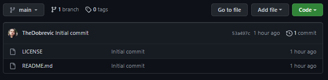

# Kodluyoruz İlk Repo
Bu repo [Kodluyoruz](www.kodluyoruz.org) GIT Eğitiminde oluşturduğumuz ilk repo, içerisinde bir adet README dosyası, bir adet de license dosyası barındırıyor.

## Installation

Öncelikle projeiy clonelayın. (Buraya sizin reponuzdan aldığınız link gelecek)

    git clone https://github.com/TheDobrevic/kodluyoruzilkrepo.git
    
## Usage

Projeyi cloneladıktan sonra Visual Studio Code programında açınız.

Linux için:

    kodluyoruzilkrepo
    code .

## Contributing

Pull requestler kabul edilir. Büyük değişiklikler için, lütfen önce neyi değiştirmek istediğinizi tartışmak için bir konu açınız.

## License
[MIT](https://choosealicense.com/licenses/mit/)
